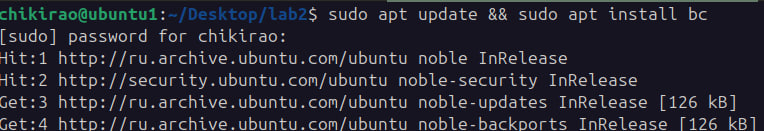
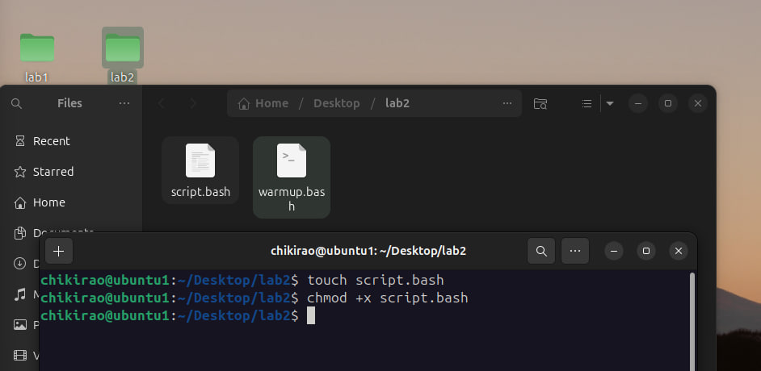
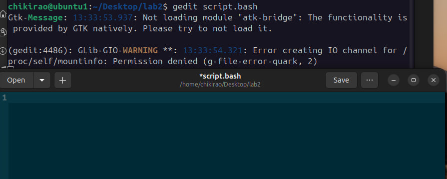
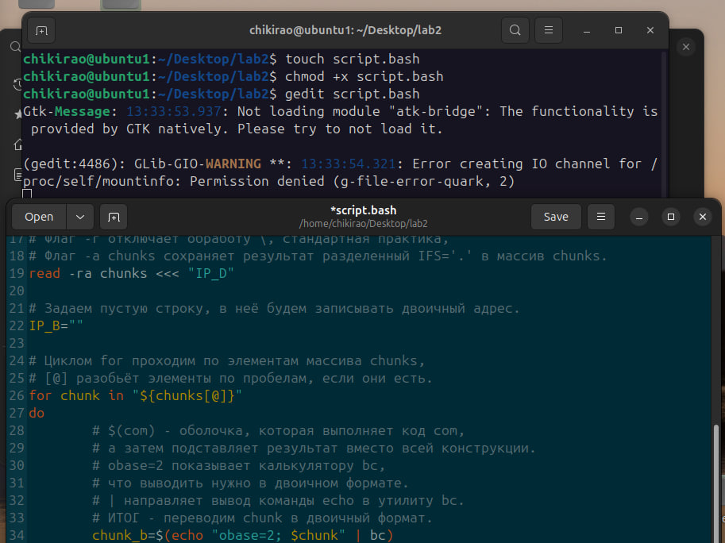
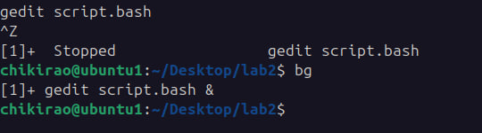
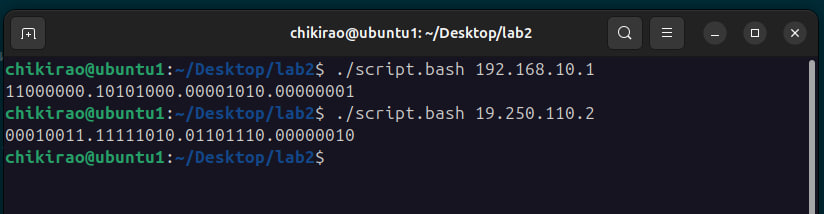

## Лабораторная работа 2

1. Устанавливает калькулятор bc, он понадобится для перевода чисел из десятичной системы в двоичную.



2. Создаём файл. С помощью chmod делаем его исполняемым, чтобы запускать его без прописывания оболочки bash. (+x значит добавить право на выполнение, execute)



3. Открываем файл в gedit.



4. Пишем код.



### Сам код с комментариями:

```bash
#!/bin/bash

# Проверяем наличие первого аргумента.
if [ -z "$1" ]
then
  echo "Адресс не указан!"
  exit 1 # Выход из скрипта с ошибкой.
fi

# Если аргумент не пустой, сохраняем адрес в переменную.
IP_D=$1

# Задаем точку разделителем для строки.
IFS='.'

# С помощью read читаем переменную адреса,
# Флаг -r отключает обработу \, стандартная практика,
# Флаг -a chunks сохраняет результат разделенный IFS='.' в массив chunks.
read -ra chunks <<< "$IP_D"

# Задаем пустую строку, в неё будем записывать двоичный адрес.
IP_B=""

# Циклом for проходим по элементам массива chunks,
# [@] разобьёт элементы по пробелам, если они есть.
for chunk in "${chunks[@]}"
do
  # $(com) - оболочка, которая выполняет код com,
  # а затем подставляет результат вместо всей конструкции.
  # obase=2 показывает калькулятору bc,
  # что выводить нужно в двоичном формате.
  # | направляет вывод команды echo в утилиту bc.
  # ИТОГ - переводим chunk в двоичный формат.
  chunk_b=$(echo "obase=2; $chunk" | bc)
  
  # printf - комманда для формированного вывода.
  # %08d говорит комманде, что если длинна строки короче 8,
  # то её нужно дополнить нулями в начале.
  padded_chunk_b=$(printf "%08d" "$chunk_b")
  
  # += дозаписывает в конец строки IP_B строку в ковычках с "." в конце.
  IP_B+="$padded_chunk_b."
done

# Так как в результате цикла в конце последней двоичной комбинации в любом
# случае будет лишняя точка, удаляем её с помощью %. в выводе через echo.
echo "${IP_B%.}"
```

5. Чтобы пользоваться терминалом пока активен gedit, замораживаем его с помощью ctrl+Z и отправляем в фон с помощью bg.



6. Проверяем, работает.

